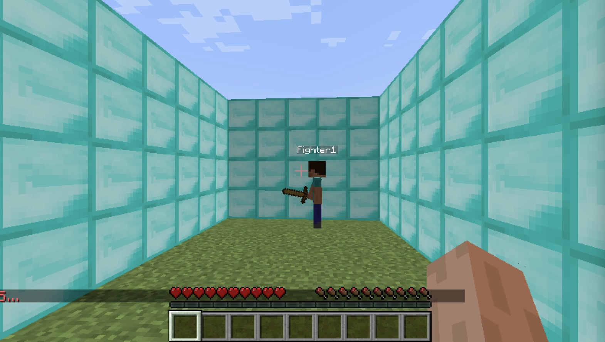
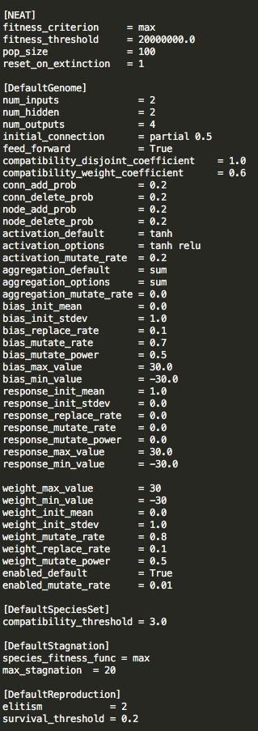
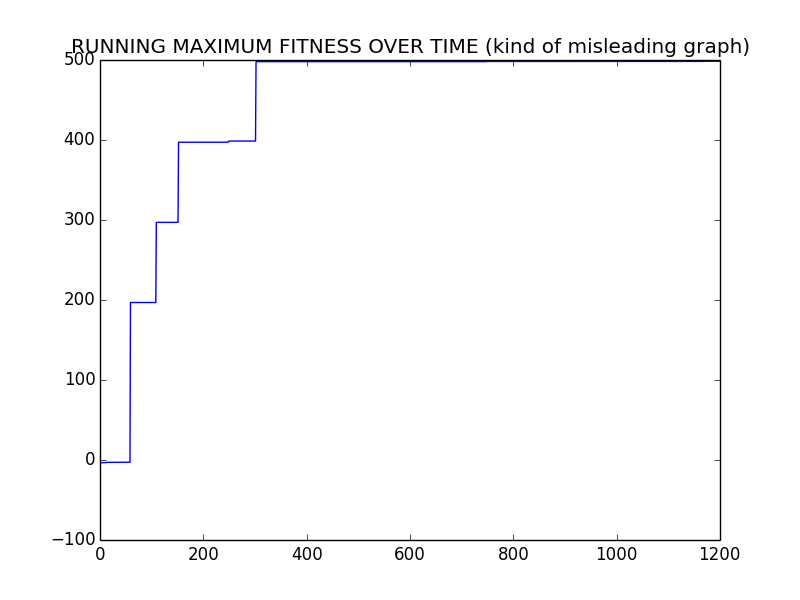

## Video

$Place holder

<iframe width="560" height="315" src="https://www.youtube.com/embed/ND62gIA778U" frameborder="0" allowfullscreen></iframe>

## Project Summary
The foundation of our project is to train an agent to fight in a 1v1 scenario. We would like our bots to evolve to learn to kill the opposing agent. We are using a Neuroevolution algorithm, which is a form of machine learning that uses genetic algorithms to evolve the structure and edge-weights of neural networks. More specifically, we are using the NeuroEvolution of Augmenting Topologies (NEAT) algorithm which was created by Ken Stanley in 2002 while he was at The University of Texas Austin. 

We have been able to train 1 bot to fight now we have expanded on this to train two bots to fight each other. We use the relative distance between both agents and the damage inflicted in our fitness function. We want to decrease the distance between the agents, so it learns to get close to the opponent as well as increase the damage it inflicts onto the opposing opponent.

## Context
As stated before, the NEAT algorithm is a type of genetic algorithm created by Ken Stanley which changes its weight parameters based on the fitness and the diversity among the specimen of each generation by tracking the history.  Although this field of "neuroevolution" (evolving the parameters of a neural net through a genetic, evolutionary algorithm) is old and dates back further than this paper, NEAT introduced the idea of "species" in the population.  
 
The idea of speciation is highly motivated by biological analogues.  Essentially, Stanley, et al. wanted to pursue the biological concept of sexual reproduction and chromosome crossover (where two successful genomes are combined to create a new, hopefully successful genome).  However, this concept proved difficult to implement for neuroevolution, since two equally-successful neural nets may have radically different *structures*, such that chromosome crossover is nonsensical and results in an unsuccessful offspring.  Previous solutions were just to give up on implementing this biologically analogous crossover by only implementing asexual reproduction, or to have the neural net's structure predetermined as a hyperparameter.  But Stanley did not give up.  Ken Stanley is a hardworking, persevering researching, and he (et al.) came up with this idea of speciation - in which genomes in the population are grouped together into species, by a similarity metric.  Only organisms within the same species are selected to mate with each other.


## Approaches

__High Level__<br> 
Before we go into the nitty gritty just wanted to explain how this is broken down. In Part I we explain how we setup our environment and different approaches we used. Part II we go into how we trained both of our agents and walk through the code. Lets get started.

__Part I__<br> 
Environment setup We created our world using Project Malmo we tired running our project on different sized worlds with different setups. 

- _10x10x4 Diamond Block Arena, No Armor_: This was our initial approach we thought if we give our agent a big enough arena. Over multiple generations we would clearly see if our agent is learning or not.


- _10x5x4 Diamond Block Enclosure, No Armor_: This was our second iteration on our environment. We wanted to test out different areas to see how greatly it would affect our agent. Our thought process was the smaller the arena the faster the agent would at first randomly hit the opponent. Which in turn would result in a better agent after the course of multiple generations. 



- _10x5x4 Diamond Block Enclosure, with Armor_: Again we tried making our area smaller for the same reasons stated above. 

Our results after comparing across final generations did not prove our hypothesis. There was no obvious direct correlation between the size of the area and how well our final generation preformed. It should be stated that this was only true at our scale testing. 


__Part II Training__<br>
Our fighter class can make four continuous moves: move, strafe, turn, and attack. It decides these commands based on the neural net’s output.  There are two inputs to the neural net: the agent's distance to the other agent, and the agent's angle to the other agent.

```python
    def run(self):
        while self.agent.peekWorldState().number_of_observations_since_last_state == 0:
            if not self.isRunning():
                return
            time.sleep(0.01)
        agent_state_input = self._get_agent_state_input()
        scaled_state_input = scale_state_inputs(agent_state_input)
        output = self.neural.activate(scaled_state_input)
        if DEBUGGING:
            print("angle {:.2f}; dist {:.2f};   move {:.3f}; strafe {:.3f}; turn {:.3f}; attack {:.3f}".format(*(agent_state_input + output)))
        if self.mission_ended or not self.agent.peekWorldState().is_mission_running:
            return
        self.agent.sendCommand("move {}".format(output[0]))
        self.agent.sendCommand("strafe {}".format(output[1]))
        self.agent.sendCommand("turn {}".format(output[2]))
        self.agent.sendCommand("attack {}".format(0 if output[3] <= 0 else 1))
```

These calculated values are then passed to AgentResult which we use as our fitness function. This assigns a fitness to each genome by giving it a scaled reward for inflicting damage and punishes the agent for elapsed time and the distance between the agent and the enemy.

```python
INFLICTED_DAMAGE_SCALE = 2#40
TIME_SCALE = 0.01#1
DISTANCE_SCALE = 0.01#100

class AgentResult:
	def __init__(self):
		self.last_time = time()
		self.distance_area = 0.0
		self.inflicted_damage = 0
		self.mission_time = 0

	def AppendDistance(self,distance):
		cur_time = time()
		time_dif = cur_time - self.last_time
		self.distance_area += time_dif * distance
		self.last_time = cur_time

	def GetFitness(self):
		# To track progress 
		print "Distance: ", self.distance_area
		print "Inflicted Damage: ", self.inflicted_damage
		return self.inflicted_damage * INFLICTED_DAMAGE_SCALE - (self.mission_time * TIME_SCALE) - DISTANCE_SCALE * self.distance_area

	def SetInflictedDamage(self, damage):
		self.inflicted_damage = damage

	def SetMissionTime(self, time):
		self.mission_time = time
```
 
## NEAT Configuration
 
Our config-fighter file has all the configuration for the NEAT algorithms parameters. We used a population size of 100 with two inputs (relative angle to the enemy and distance) and one hidden input. As of current, we are using relu for our activation function but there are other options available to fine tune the learning process. The neat-python library allows us to specify mutation rate, probabilities of adding or removing an edge or node, aggregation in the neural nets, and much more. 




## Evaluation

To evaluate our performance, we run our evolutionary program for 10 hours and see if the final generation has learned to kill the opponent.  So far, we have been unsuccessful at reaching this goal.  In the absence of complete success, we look at our bots' fitness throughout generations and see if there is a positive trend.  So far, we have been lackluster at reaching this goal when our population size was 20.




## Improvements 

After increasing the population size to 100 we began to see improvments.


## References
[Link to a NEAT paper](http://nn.cs.utexas.edu/downloads/papers/stanley.ec02.pdf)

[Evolution Strategies](https://blog.openai.com/evolution-strategies/)


